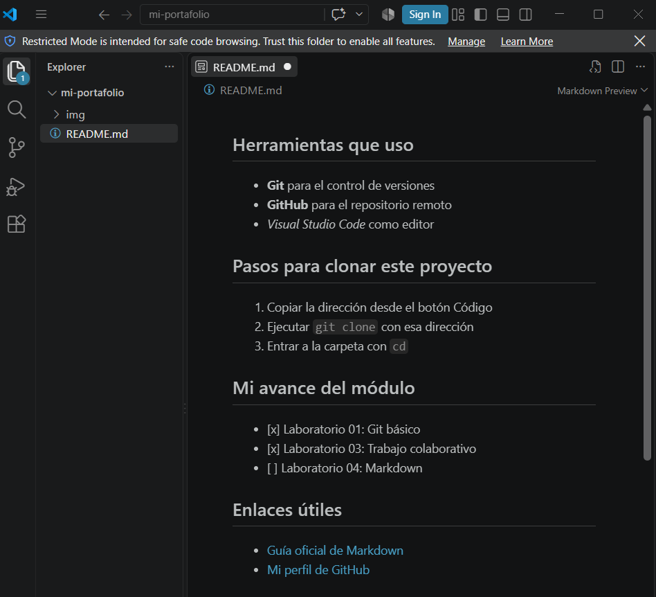

## Herramientas que uso

- **Git** para el control de versiones
- **GitHub** para el repositorio remoto
- *Visual Studio Code* como editor

## Pasos para clonar este proyecto

1. Copiar la dirección desde el botón Código
2. Ejecutar `git clone` con esa dirección
3. Entrar a la carpeta con `cd`

## Mi avance del módulo

- [x] Laboratorio 01: Git básico
- [x] Laboratorio 03: Trabajo colaborativo
- [ ] Laboratorio 04: Markdown

## Enlaces útiles

- [Guía oficial de Markdown](https://www.markdownguide.org/)
- [Mi perfil de GitHub](https://github.com/jemaluna-dotcom)
## Captura de mi trabajo

